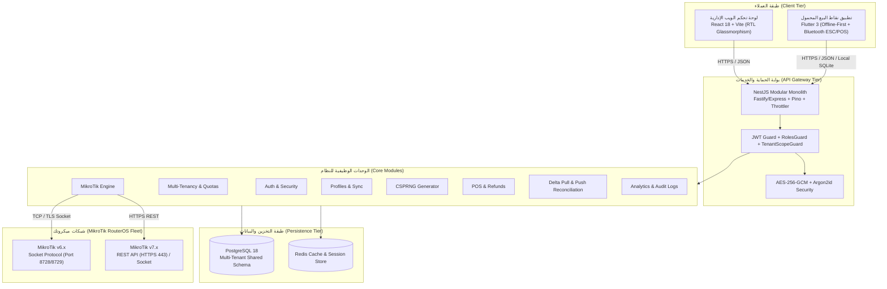

# وثيقة المعمارية الهندسية الشاملة (System Architecture Reference)

## MikroTik HotSpot Cards Management SaaS Platform

---

### 1. نظرة عامة ورؤية النظام (High-Level Architecture)

تم تصميم المنصة وفق نمط **Modular Monolith** فائق الأداء للواجهة الخلفية مع
تقسيم متقن للمجالات (Domain-Driven Boundaries)، لخدمة كل من:

- لوحة التحكم السحابية الإدارية لمديري المنظومة والمستأجرين (**React 18 +
  Vite**).
- تطبيق المبيعات المحمول الميداني لنقاط البيع السريعة والطباعة الحرارية عبر
  البلوتوث (**Flutter 3 / Dart 3**).
- موجهات شبكات ميكروتك الفيزيائية والافتراضية عبر بروتوكولات ثنائية هجينة
  (**RouterOS Socket API & REST API**).

---

### 2. نموذج عزل وتعدد المستأجرين (Multi-Tenancy Architecture)

تعتمد المنصة معمارية **Shared Database, Shared Schema with Discriminator Column
(`tenantId`)**:

1. **استخراج السياق التلقائي (`TenantContextService`):**
   - تقوم وسيطة الـ Guard بالتحقق من هوية المستأجر عبر التوكن (`tenantId`
     المطابق لبيانات الـ JWT).
   - بالنسبة للمدير العام المنظومي (`SUPER_ADMIN`)، يُسمح بالتبديل بين
     المستأجرين عبر ترويسة مخصصة `x-tenant-id` مع تسجيل تدقيق غير قابل للإنكار
     (Non-Repudiation Audit).
2. **عزل استعلامات قاعدة البيانات:**
   - كافة استعلامات Prisma تعتمد فلترة إلزامية على مستوى `where: { tenantId }`.
   - لا يمكن للمستأجر (أ) الاستعلام عن كروت أو مبيعات أو موجهات المستأجر (ب)
     نهائياً على مستوى طبقة الخدمات ومستودعات البيانات.
3. **الحصص الاستيعابية والمحددات (Tenant Quotas):**
   - كل مستأجر مقيد بحدود للاشتراك تشمل: `maxDevices`، `maxActiveCards`،
     `maxUsers`، وتاريخ انتهاء الصلاحية `subscriptionExpiresAt`.
   - عند محاولة تجاوز الحصص، ترفض المنظومة العملية فورياً عبر
     `QuotaExceededException`.

---

### 3. المعمارية الأمنية والتشفير (Security & Cryptographic Architecture)

1. **تشفير كلمات المرور (Argon2id Hashing):**
   - حماية كلمات المرور باستخدام خوارزمية Argon2id بمحددات أمان قصوى:
     - الذاكرة: 64MB (`memoryCost: 65536`).
     - التكرار الزمني: 3 دورات (`timeCost: 3`).
     - التوازي: 4 خيوط (`parallelism: 4`).
2. **تشفير البيانات الحساسة أثناء السكون (AES-256-GCM Encryption at Rest):**
   - يتم تشفير كلمات مرور روترات ميكروتك، ومفاتيح API السرية، وأرقام الـ PIN
     للبطاقات باستخدام مفتاح متماثل 256-bit، مع توليد ناقل تهيئة فريد (IV - 12
     bytes) ووسم مصادقة (Auth Tag - 16 bytes) لكل سجل لمنع التلاعب
     (Authenticated Encryption).
3. **توليد أكواد البطاقات الآمن (CSPRNG):**
   - استخدام مولد الأرقام العشوائية الآمن برمجياً `crypto.randomBytes` مع
     استبعاد الحروف والأرقام الملتبسة بصرياً (`0, O, 1, I, l`) لمنع أخطاء
     المستخدمين، مع خوارزمية فحص التكرار (Collision Detection) وضمان التفرد.
4. **الحماية ضد هجمات الحرمان من الخدمة وهجمات التخمين (Rate Limiting &
   Throttler):**
   - تقييد مسارات تسجيل الدخول بـ 10 محاولات لكل 15 دقيقة لكل عنوان IP.
   - تقييد المسارات العامة بـ 300 طلب لكل دقيقة لمنع استنزاف موارد النظام.

---

### 4. محرك ميكروتك الهجين (MikroTik RouterOS Dual-Protocol Engine)

يدعم النظام التوافق السلس مع كافة إصدارات MikroTik:

1. **بروتوكول المقابس الثنائي (Socket API Protocol):**
   - يعمل على المنفذ 8728 (أو 8729 عبر SSL).
   - تنفيذ ترميز طول الكلمة المخصص لميكروتك (Variable-Length Word Encoding).
   - دعم التوثيق الثنائي: Challenge-Response (MD5) للإصدارات القديمة (v6.42 وما
     قبلها) والتوثيق الصريح المباشر للإصدارات الحديثة.
2. **بروتوكول REST API (RouterOS v7.1+):**
   - التواصل المباشر عبر HTTPS JSON API لسرعة جلب التليمتري ومراقبة موارد
     المعالج والذاكرة والمستخدمين النشطين.
3. **المرونة وتحمل الأعطال (Fault Tolerance):**
   - تطبيق نمط مجمع الاتصالات (Connection Pooling) مع محاولات إعادة الاتصال
     التلقائية وفق خوارزمية التراجع الأسي (Exponential Backoff with Jitter).
   - عزل أخطاء الاتصال بالراوتر بحيث لا تتسبب في إيقاف خادم الـ API أو تجميد
     واجهة المستخدم.

---

### 5. محرك المزامنة غير المتصلة لتطبيق الجوال (Offline-First Sync Engine)

1. **العمل بدون اتصال بالإنترنت (Offline Autonomy):**
   - يحتوي تطبيق فلاتر على محفظة محلية مستمرة تحفظ البطاقات المحجوزة مسبقاً
     (`RESERVED`) المشفرة محلياً.
   - يمكن لنقطة البيع إتمام البيع، وتوليد الإيصال وطباعته حرارياً دون الحاجة
     للاتصال بالإنترنت فوراً.
2. **محرك حجز البطاقات المسبق (Card Reservation Batching):**
   - مسار `/sync/reserve-cards` يسمح للمحاسب المعتمد بحجز حزمة بطاقات (مثلاً 50
     كرت) مخصصة لجهازه برقم تسلسلي وحيد `reservationBatchId`.
3. **المزامنة التفاضلية وتسوية التعارضات (Delta Pull & Push Reconciliation):**
   - مسار `/sync/pull`: يجلب فقط التعديلات التي تمت بعد آخر ختم زمني
     (`lastPulledAt`).
   - مسار `/sync/push`: يستقبل العمليات غير المتزامنة مع تطبيق مبدأ "الخادم هو
     المصدر النهائي للحقيقة (Server-Wins Resolution)" لمنع تكرار بيع البطاقات أو
     التعارضات المالية.

---

### 6. محرك استوديو الطباعة (Print Studio CSS Engine)

1. **الطباعة على شبكات ورق A4:**
   - شبكة هندسية دقيقة مقسمة بنظام CSS Grid تتسع لـ 8 بطاقات متناسقة لكل ورقة مع
     هوامش قطع (Cut Lines) وشعار الشبكة وبيانات الحساب ورمز QR عالي الدقة.
2. **الطباعة على بكرات الإيصالات الحرارية (Thermal Rolls 58mm / 80mm):**
   - عزل كامل لوسيط الطباعة `@media print`.
   - إخفاء تام لكافة أشرطة التنقل، الأزرار، واللوحات الخلفية.
   - تنسيق أحادي اللون بنظام درجات الرمادي لضمان أعلى تباين ممكن على الطابعات
     الحرارية المباشرة (ESC/POS).
